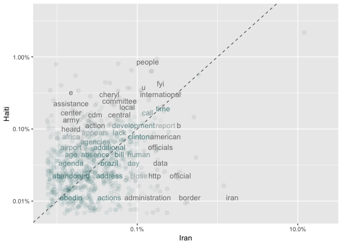

Reading Hillary Clinton's Emails
================

Why?
----

I like politics, am interested in NLP, and would like to know what Hillary and her co-workers were emailing about that caused such a fuss.

Some info about the data
------------------------

-   There are just under 8,000 emails in this data set <br>
-   Kaggle performed some processing to extract and clean the emails<br>
-   The code that prepared the data is available at <a href="https://github.com/benhamner/hillary-clinton-emails">this GitHub Repo</a>

<!-- -->

    ## 
    ## Attaching package: 'dplyr'

    ## The following objects are masked from 'package:stats':
    ## 
    ##     filter, lag

    ## The following objects are masked from 'package:base':
    ## 
    ##     intersect, setdiff, setequal, union

    ## Loading required package: RColorBrewer

    ## Observations: 7,945
    ## Variables: 22
    ## $ Id                           <int> 1, 2, 3, 4, 5, 6, 7, 8, 9, 10, 11...
    ## $ DocNumber                    <chr> "C05739545", "C05739546", "C05739...
    ## $ MetadataSubject              <chr> "WOW", "H: LATEST: HOW SYRIA IS A...
    ## $ MetadataTo                   <chr> "H", "H", ";H", "H", "Abedin, Hum...
    ## $ MetadataFrom                 <chr> "Sullivan, Jacob J", "", "Mills, ...
    ## $ SenderPersonId               <int> 87, NA, 32, 32, 80, 80, 32, 80, 8...
    ## $ MetadataDateSent             <chr> "2012-09-12T04:00:00+00:00", "201...
    ## $ MetadataDateReleased         <chr> "2015-05-22T04:00:00+00:00", "201...
    ## $ MetadataPdfLink              <chr> "DOCUMENTS/HRC_Email_1_296/HRCH2/...
    ## $ MetadataCaseNumber           <chr> "F-2015-04841", "F-2015-04841", "...
    ## $ MetadataDocumentClass        <chr> "HRC_Email_296", "HRC_Email_296",...
    ## $ ExtractedSubject             <chr> "FW: Wow", "", "Re: Chris Stevens...
    ## $ ExtractedTo                  <chr> "", "", "B6", "", "", "", "", "",...
    ## $ ExtractedFrom                <chr> "Sullivan, Jacob J <Sullivan11@st...
    ## $ ExtractedCc                  <chr> "", "", "Abedin, Huma", "Mitchell...
    ## $ ExtractedDateSent            <chr> "Wednesday, September 12, 2012 10...
    ## $ ExtractedCaseNumber          <chr> "F-2015-04841", "F-2015-04841", "...
    ## $ ExtractedDocNumber           <chr> "C05739545", "C05739546", "C05739...
    ## $ ExtractedDateReleased        <chr> "05/13/2015", "05/13/2015", "05/1...
    ## $ ExtractedReleaseInPartOrFull <chr> "RELEASE IN FULL", "RELEASE IN PA...
    ## $ ExtractedBodyText            <chr> "", "B6\nThursday, March 3, 2011 ...
    ## $ RawText                      <chr> "UNCLASSIFIED\nU.S. Department of...

What words show up most often in the email subjects
---------------------------------------------------

I used the MetadataSubject Variable for this plot:

``` r
tidy.email.subject <- email %>%
                unnest_tokens(word, MetadataSubject)

data("stop_words")
tidy.email.subject <- tidy.email.subject %>%
                anti_join(stop_words)
```

    ## Joining, by = "word"

``` r
tidy.email.subject %>%  
    count(word, sort = TRUE) %>%  
    filter(n > 50) %>%  
    mutate(word = reorder(word, n)) %>%  
    ggplot(aes(word, n)) +  
    geom_bar(stat = "identity") +  
    xlab(NULL) +  
    coord_flip()
```


``` r
tidy.email.subject %>%
    mutate(word = str_extract(word, "[a-z']+")) %>%
    count(word) %>%
    with(wordcloud(word, n, max.words = 50))
```


Haiti vs. Iran
--------------

The prior plot showed that Haiti and Iran were the two countries that showed up most frequently in email's subjects

So let's compare the words in those emails:

    ## Joining, by = "word"
    ## Joining, by = "word"

    ## # A tibble: 2,629 × 2
    ##           word     n
    ##          <chr> <int>
    ## 1        haiti   161
    ## 2       people    76
    ## 3      haitian    70
    ## 4  settlements    52
    ## 5   government    39
    ## 6          fyi    38
    ## 7    including    33
    ## 8         plan    32
    ## 9          u.s    32
    ## 10    security    31
    ## # ... with 2,619 more rows

    ## # A tibble: 3,271 × 2
    ##            word     n
    ##           <chr> <int>
    ## 1          iran   101
    ## 2       iranian    59
    ## 3          2009    57
    ## 4        iran's    51
    ## 5   ahmadinejad    41
    ## 6          2005    36
    ## 7  presidential    36
    ## 8      election    31
    ## 9        border    30
    ## 10         iraq    26
    ## # ... with 3,261 more rows

    ## Joining, by = "word"

    ## Warning: Removed 1560 rows containing missing values (geom_point).

    ## Warning: Removed 1561 rows containing missing values (geom_text).


